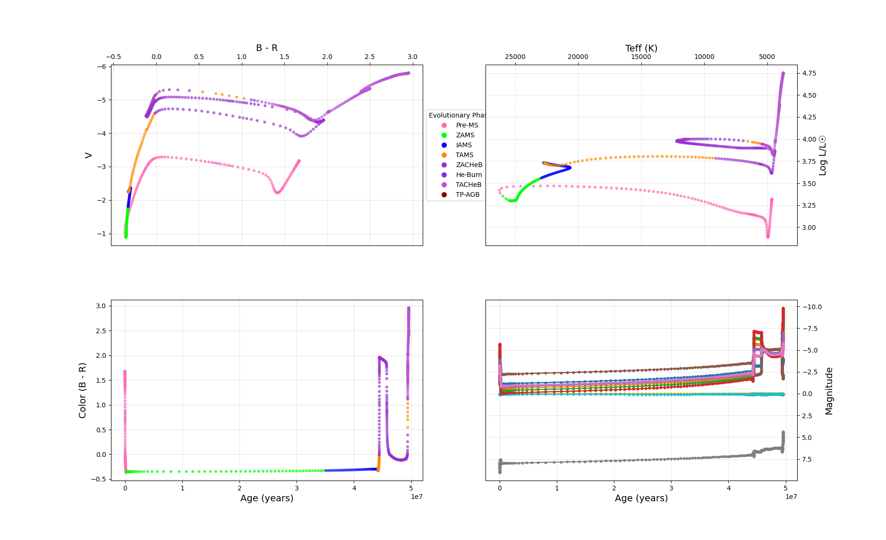

.. _mesa-colors-post:

*****************
mesa-colors-post
*****************

``mesa-colors-post`` is a standalone post-processor that computes synthetic photometry from a completed MESA run, without requiring the ``colors`` module to have been active during the simulation itself.

After a MESA run, the post-processor reads the existing ``LOGS/history.data`` file, extracts the stellar parameters at each saved model, and calls the MESA ``colors`` library to compute bolometric magnitudes, bolometric flux, and synthetic magnitudes in every filter defined by the chosen instrument. The photometric columns are then stitched back onto the original history file by ``stitch_history.py``, producing a single enriched ``history.data`` that can be read by any standard MESA analysis tool.

----

This repository contains post-processor implementations for MESA versions ``25.12.1`` and ``26.3.2``; select the subdirectory matching your installed MESA version.

----

Quick Start
===========

.. code-block:: bash

   cd 26.3.2          # or 25.12.1
   make               # compile (26.3.2) — or ./mk for 25.12.1
   ./colors_post_proc # run the post-processor

After a successful run, stitch the colors output onto the history file:

.. code-block:: bash

   cd python_helpers
   python stitch_history.py

The original ``history.data`` is preserved as ``history.data_old`` and replaced in-place with the stitched result.

----

Required History Columns
=========================

The post-processor reads the following columns from ``history.data``. All must be present:

* ``star_age``
* ``log_Teff`` or ``Teff``
* ``log_g``
* ``log_R`` or ``radius``
* ``surface_h1``
* ``surface_he4``

Metallicity ([Fe/H]) is computed internally from ``surface_h1`` and ``surface_he4`` as:

.. code-block:: text

   Z = 1 - X - Y
   [Fe/H] = log10(Z/X) - log_ZX_solar

----

Inlist
======

All controls live in a single ``inlist`` file containing two namelists: ``&post_proc`` and ``&colors``.

&post_proc
----------

``history_file``
   Path to the input MESA history file.

   **Default:** ``'LOGS/history.data'``

``output_file``
   Path for the colors post-processor output. This is an intermediate file; ``stitch_history.py`` reads it and merges it into the history file.

   **Default:** ``'post_proc_output.data'``

``log_ZX_solar``
   Solar reference value log₁₀(Z☉/X☉) used for computing [Fe/H]. The default matches GS98 (Z☉ = 0.0188, X☉ = 0.7379), which is the solar reference for the Kurucz2003all atmosphere grid shipped with MESA. Change this if using a different atmosphere grid with a different solar reference.

   **Default:** ``-1.594``

**Example:**

.. code-block:: fortran

   &post_proc
      history_file  = 'LOGS/history.data'
      output_file   = 'post_proc_output.data'
      log_ZX_solar  = -1.594d0
   /

&colors
-------

The ``&colors`` namelist is identical to the one used by the MESA ``colors`` runtime module. The full parameter reference—including ``instrument``, ``stellar_atm``, ``vega_sed``, ``distance``, ``mag_system``, ``make_csv``, ``sed_per_model``, ``colors_results_directory``, and the extra inlist mechanism—is documented in the MESA ``colors`` module README.

**Example:**

.. code-block:: fortran

   &colors
      use_colors               = .true.
      instrument               = 'data/colors_data/filters/Generic/Johnson'
      stellar_atm              = 'data/colors_data/stellar_models/Kurucz2003all/'
      vega_sed                 = 'data/colors_data/stellar_models/vega_flam.csv'
      distance                 = 3.0857d19
      mag_system               = 'Vega'
      make_csv                 = .false.
      colors_results_directory = 'SED'
   /

----

stitch_history.py
=================

Appends the photometric columns produced by ``colors_post_proc`` onto the original MESA history file. Reads ``history_file`` and ``output_file`` from the ``&post_proc`` namelist in the ``inlist`` one directory above the script, so no arguments are needed.

.. code-block:: bash

   python stitch_history.py

The script renames the original ``history.data`` to ``history.data_old`` and writes the stitched file in its place. Row counts between the history file and the colors output must match exactly; the script exits with an error message if they do not.

It can also be imported and called from another script:

.. code-block:: python

   from stitch_history import stitch
   stitch(root_dir)   # root_dir is the directory containing the inlist

----

Python Helper Scripts
=====================

All helpers live in ``python_helpers/`` and are run from that directory. Paths default to ``../LOGS/`` and ``../SED/`` relative to that location.

plot_history.py
---------------

**Purpose:** Single-shot four-panel diagnostic plot of a completed ``history.data``. Intended for post-run analysis, and acts as a shared library imported by ``plot_history_live.py``, ``movie_history.py``, and ``movie_cmd_3d.py``.

**What it shows:**

* **Top-left**: Color–magnitude diagram (CMD) built automatically from whichever filters are present in the history file. Filter priority: Gaia (Gbp−Grp), then Johnson (B−R or B−V or V−R), then Sloan (g−r), with a fallback to the first and last available filter.
* **Top-right**: Classical HR diagram (Teff vs. log L).
* **Bottom-left**: Color index as a function of stellar age.
* **Bottom-right**: Light curves for all available filter bands simultaneously.

All panels are color-coded by MESA's ``phase_of_evolution`` integer if that column is present. The first 5 model rows are skipped (``MesaView`` skip=5) to avoid noisy pre-MS relaxation artifacts.

plot_history_live.py
--------------------

**Purpose:** Live-updating version of the same four-panel viewer, designed to run *during* a MESA simulation. Polls ``../LOGS/history.data`` every 0.1 seconds and redraws whenever the file changes. Prints a change notification for the first five updates, then goes silent. Close the window to exit.

plot_sed.py
-----------

**Purpose:** Single-shot plot that reads all ``*SED.csv`` files in ``../SED/`` and overlays them in one figure. Requires ``make_csv = .true.`` in the inlist. The x-axis is cropped to 0–60 000 Å by default; edit the ``xlim`` argument in ``main()`` to change this.

plot_zero_points.py
-------------------

**Purpose:** Runs the post-processor three times in sequence with ``mag_system`` set to ``'Vega'``, ``'AB'``, and ``'ST'`` respectively, then overlays the resulting CMDs in a single comparison figure. Useful for quantifying zero-point offsets between magnitude systems for a given filter set.

The script must be run from within ``python_helpers/``. It temporarily modifies the inlist for each run and restores it afterwards, saving intermediate LOGS directories as ``LOGS_Vega``, ``LOGS_AB``, and ``LOGS_ST``. The comparison figure is saved to ``mag_system_comparison.png``.

movie_history.py
----------------

**Purpose:** Renders the same four-panel display as ``plot_history_live.py`` into an MP4 video, with one frame per model row. Points accumulate from left to right in time so the full evolutionary track builds up across the video. Writes ``history.mp4`` at 24 fps, 150 dpi. Requires ``ffmpeg`` on ``$PATH``; progress is shown with ``tqdm`` if available.

----

Data Preparation (SED_Tools)
=============================

The ``colors`` module requires pre-processed stellar atmospheres and filter profiles organised in a specific directory structure. To automate this workflow, use the dedicated repository:

**Repository:** `SED_Tools <https://github.com/nialljmiller/SED_Tools>`_

SED_Tools downloads, validates, and converts raw atmosphere grids and filter transmission curves into the exact structure required by MESA. A browsable mirror of the processed output is also available at the `SED Tools Web Interface <https://nillmill.ddns.net/sed_tools/>`_.
